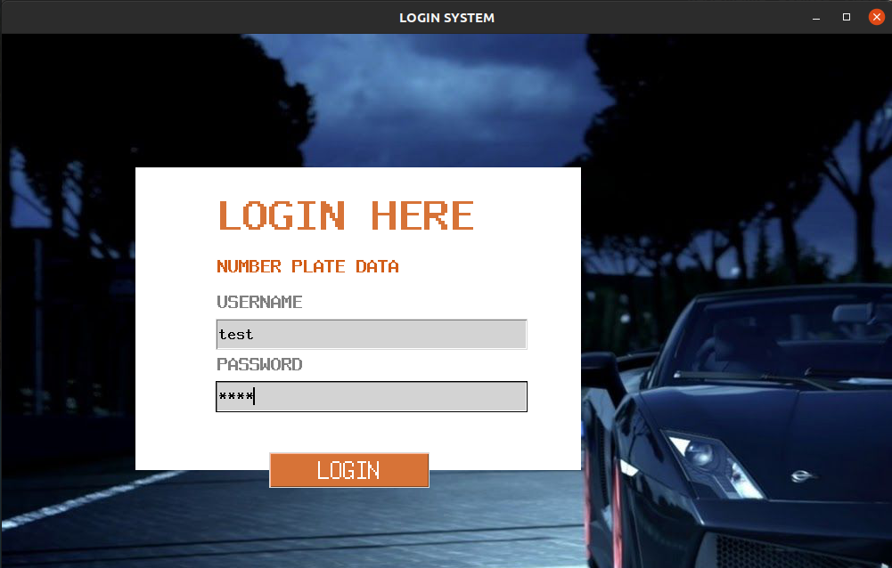
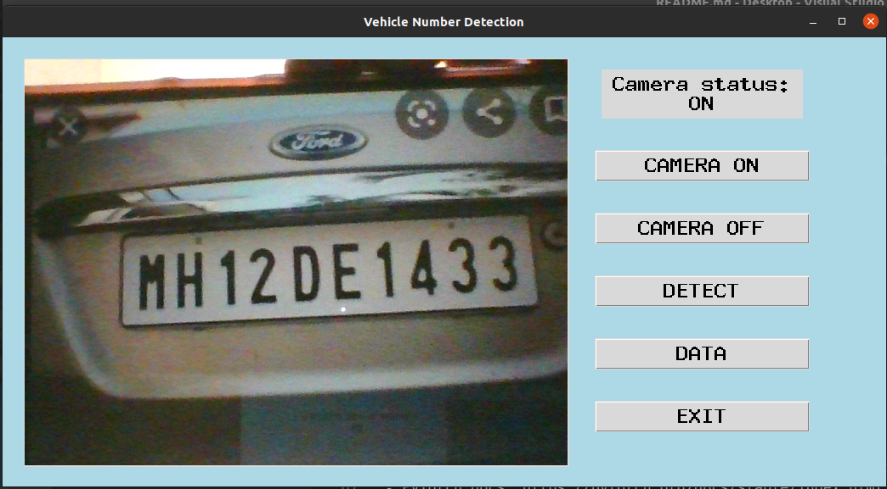
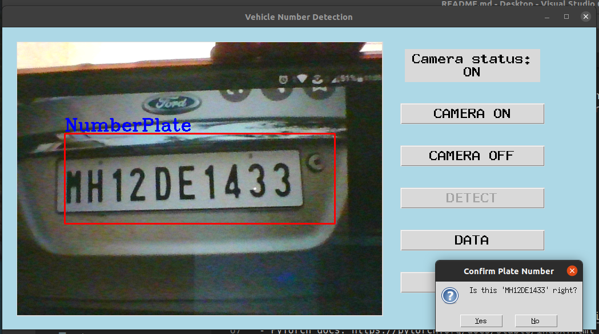

# Vehicle Number Recognition

A project will detect Vehicle Registration Number(VRN) with help of **OpenCV** and **PyTorch** library of **Python**. It will also help record those numbers in Database. Vehicle Registration Number Recognition is done is two phases:
1. Number Plate Detection *using OpenCV's pre-trained Cascade Classifier*(accuracy: max 70%). 
2. Text Recognition *using RCNN Architecture in PyTorch*(accuracy: 92%).


### Repository Structure

Vehicle-Number-Recognition(repository)  
&nbsp;&nbsp;|  
&nbsp;&nbsp;|---NPR(Number Plate Recognition Package)  
&nbsp;&nbsp;|&nbsp;&nbsp;&nbsp;&nbsp;|---gui  
&nbsp;&nbsp;|&nbsp;&nbsp;&nbsp;&nbsp;|&nbsp;&nbsp;&nbsp;&nbsp;|---images  
&nbsp;&nbsp;|&nbsp;&nbsp;&nbsp;&nbsp;|---ml_assets  
&nbsp;&nbsp;|---datasets  
&nbsp;&nbsp;|---notebooks  
&nbsp;&nbsp;|---models

# Software Requirements
- Python 3.x
- PIP (package manager for python)
- MySQL Database ((Installation Guide)[https://dev.mysql.com/doc/mysql-installation-excerpt/5.7/en/])
##### For Linux:
```
sudo apt install python3
sudo apt install python3-pip
````
##### For Windows:
Installion guide for Python & PIP: https://docs.python.org/3/using/windows.html  
>**NOTE:** Don't forget to add python environment variable in your machine or it will throw external command error.
  
# How to install?
Change your current working directory of `terminal/CMD` to desired location to download VNR Repository and execute following command:
```
git clone https://github.com/hkaranjule77/Vehicle-Number-Recognition.git
```

### Creating Environment for third-party packages (optional)
Before installing third-party library, we recommend to use a `conda` or `virtualenv` environment to create new environment to avoid dependecy conflict.  
  
**For conda:**  
Official Anaconda Installation Guide: https://docs.anaconda.com/anaconda/install/  
Use following commands to create new environment in conda: 
```
conda create -n environment_name python==3.8  # creates new environment

conda activate environment_name               # takes into new environment
```  
  
  
### How to install third-party libraries?(for production only)
Excute the following command in `terminal/CMD` to install required libraries:
```
pip install -r requirements.txt
```  
# How to run?
Change current working directory inside the repository and run the following command:  
Linux:
```
python3 main.py
```
Windows:
```
python main.py
```

# GUI

  
  
  

# References
- OpenCV docs: https://docs.opencv.org/master/d6/d00/tutorial_py_root.html
- PyTorch docs: https://pytorch.org/docs/stable/index.html
- Haar features: https://www.youtube.com/watch?v=F5rysk51txQ
- RCNN Architecture: https://www.youtube.com/watch?v=IcLEJB2pY2Y&t=3161s

# Contributors
-[Harshad Karanjule](https://github.com/hkaranjule77)
-[Arshad Majgaonkar](https://github.com/ArshadMajgaonkar)
-[Sanket Mane](https://github.com/Sanket-Mane)
